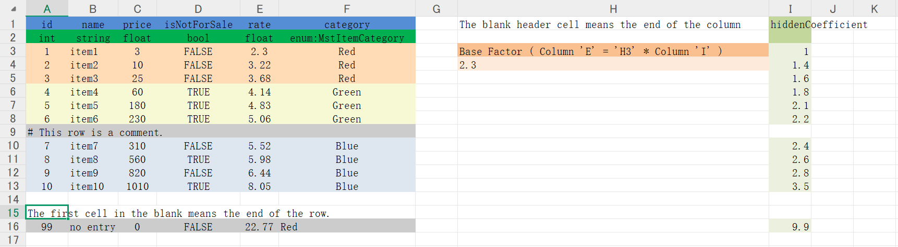
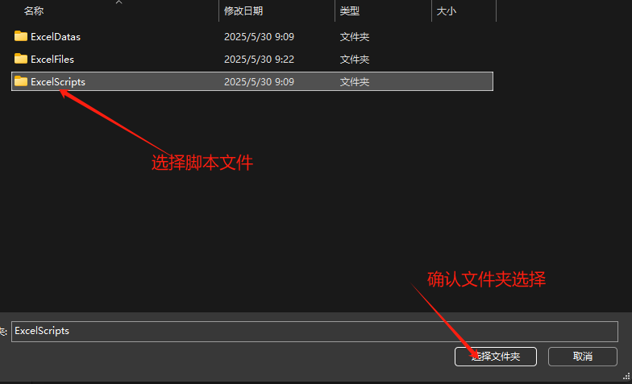
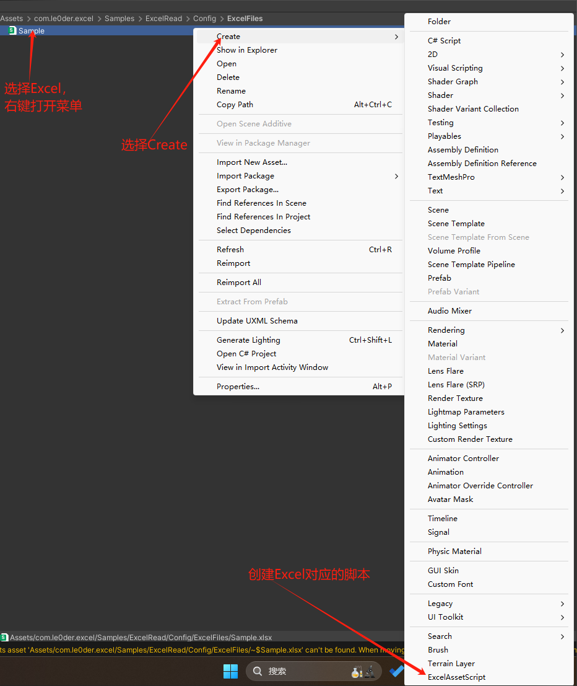
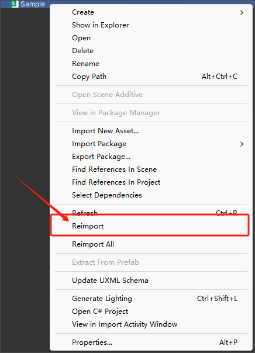
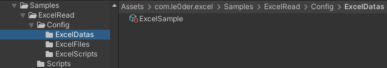

# Le0der Excel工具包（Excel Toolkit）

​	本工具用于在 Unity 中自动读取 Excel 表格，并将其转换为 ScriptableObject 格式的数据文件与对应的数据类代码，方便在项目中直接使用。
​	该工具已按 Unity Package Manager（UPM）规范封装，可通过 Git 地址直接集成到 Unity 项目中。

---

## 📦 包信息
**包名**：`com.le0der.excel`

**最低支持 Unity 版本**：`2020.3` 

**作者**：[Le0der](https://github.com/le0der)

---

## ✨ 功能特色

- ✅ 集成[NPOI](https://github.com/tonyqus/npoi/)工具，不需要其他额外依赖，可独立使用
- ✅ Unity Editor内操作，无需额外软件
- ✅ 自动更新数据类实例，无需手动更新防止遗忘
- ✅ 支持表格内数据是由公式生成

---

## 📥 安装方式

你可以通过以下任一方式将该工具包集成到你的 Unity 项目中：

### ✅ 方法 1：使用 Unity 编辑器内的 Package Manager 添加 Git 地址（推荐）

1. 打开 Unity 的菜单：Window > Package Manager

2. 点击左上角的 + 号按钮

3. 选择 Add package from Git URL...

4. 输入：
```arduino
https://github.com/le0der-tools/com.le0der.excel.git
```
### ✅ 方法 2：使用 Git URL 添加依赖

1. 打开你的 Unity 项目
2. 编辑文件：`Packages/manifest.json`
3. 在 `"dependencies"` 节点中添加如下内容：

```json
"com.le0der.excel": "https://github.com/le0der-tools/com.le0der.excel.git"
```
---

## 📘 使用说明：Unity Excel 读取工具
### 📂 文件夹结构建议
​	建议创建以下三个文件夹用于管理不同类型的资源：

- `ExcelFiles`：用于存放原始的 Excel 文件（.xlsx）。
- `ExcelDatas`：用于存放自动生成的 ScriptableObject 数据文件。
- `ExcelScripts`：用于存放自动生成的 C# 数据类脚本文件。

## 📄 Excel 文件规范
1. 表格头要求：

   - 第一行为字段名
   - 第二行为字段类型

2. 表格读取范围：

   表格中遇到**空白行**或**空白列**将终止读取该区域后续数据。

3. 表格信息注释：

   若某行的**第一列第一个字符为 `#`**，则该行视为**注释行**，不参与数据读取。
    <font color='#FF0000'>**禁止在前两行（字段名和字段类型）使用注释行**，否则将导致生成异常。</font>
    

### 🛠 使用步骤（V 1.0.2版本及以上版本）

🚨 自 v1.2 起，右键菜单操作已弃用，所有功能已迁移至顶部菜单栏 `Le0der Toolkits` 中。
 🧭 菜单路径：`Le0der Toolkits → Excel`

1️⃣ 生成数据类脚本

1. 在 Project 窗口中选中Excel文件（`.xlsx` 或 `.xls`）。

2. 在顶部菜单栏点击：

   ```nginx
   Le0der Toolkits → Excel → 生成数据代码
   ```

3. 弹出的文件夹选择框中，选择生成 C# 脚本的保存路径（建议为 `ExcelScripts` 文件夹）。

   

4. 工具将自动为 Excel 文件和文件中的每个Sheet生成对应的脚本：

    生成代码请见下方 “代码生成说明”。
#### 2️⃣ 生成 ScriptableObject 数据文件

1. 在 Project 窗口中选中Excel文件（`.xlsx` 或 `.xls`）。

2. 在顶部菜单栏点击：

   ```nginx
   Le0der Toolkits → Excel → 重新导入选中表格
   ```

3. 工具会在 `[ExcelAsset]` 指定或默认路径中自动生成对应的 ScriptableObject 数据文件。

### 🛠 使用步骤（V 1.0.1版本及以前）

#### 1️⃣ 生成数据类脚本
1. 在 Project 窗口中，右键点击 Excel 文件，选择 **Create -> ExcelAssetScript**。

   

2. 弹出的文件夹选择框中，选择生成 C# 脚本的保存路径（建议为 `ExcelScripts` 文件夹）。

   

3. 工具将自动为 Excel 文件和文件中的每个Sheet生成对应的脚本：

    生成代码请见下方 “代码生成说明”。

#### 2️⃣ 生成 ScriptableObject 数据文件

1. 再次右键点击 Excel 文件。

2. 选择 ReImport。
   

3. 工具会自动在 指定 文件夹中生成对应的 ScriptableObject 数据文件。
   
   

### ✏️ 代码生成说明
   ​	📌 表格代码生成规则

   - 表格类脚本文件 `Excel<表格名称>.cs`

   - 表格类类名`Excel<表格名称>`

   - 表格类中字段结构：

     ```c#
     public List<SheetEntity<Sheet名称>> <Sheet名称>;
     ```

   ​	📌 Sheet 类命名规则

   - Sheet类脚本文件 `SheetEntity<sheet名称>.cs`

   - Sheet类类名`SheetEntity<Sheet名称>`

   - Sheet 类中字段结构：

     ```csharp
     public <字段类型> <字段名>;
     ```

1. 自定义 Attribute参数控制ScriptableObject 数据生成

   ​	`ExcelAssetAttribute` 是本工具中用于标记 Excel 数据类（ScriptableObject）的自定义特性。它负责告诉工具如何关联 Excel 表格、生成的 ScriptableObject 应该保存在哪，以及是否记录导入日志。

   📦 **功能说明**

   通过在生成的主类上添加 `[ExcelAsset]`，你可以控制：

   | 属性名        | 类型     | 说明                                                         |
   | ------------- | -------- | ------------------------------------------------------------ |
   | `ExcelName`   | `string` | 指定绑定的 Excel 文件名（不含扩展名）。用于类名与文件名不一致时进行匹配。 |
   | `AssetPath`   | `string` | 指定生成的 ScriptableObject 文件夹路径。支持相对 `Assets/` 路径或相对 Excel 路径（需搭配 `IsRelative = true`）。 |
   | `IsRelative`  | `bool`   | 如果为 `true`，表示 `AssetPath` 是相对于 Excel 文件的路径；否则是相对于 `Assets/` 目录的路径。 |
   | `LogOnImport` | `bool`   | 是否在导入时打印日志。                                       |

   ✅ **基础用法**

   1. 情况 1：类名与 Excel 文件名一致， `asset `生成在excel同级目录

      ```c#
      [ExcelAsset]
      public class ExcelSample : ScriptableObject
      {
          public List<SheetEntityItem> Sample;
      }
      ```
   
   2. 情况 2：类名与 Excel 文件名不同
   
      ```c#
      [ExcelAsset(ExcelName = "ItemTable")]
      public class ExcelItemConfig : ScriptableObject
      {
          public List<SheetEntityItem> Sample;
      }
      ```
      
      🔹 Excel 文件名为 `ItemTable.xlsx`，类名为 `ExcelItemConfig`。用 `ExcelName` 显式匹配。
   
   
   
   3. 情况 3：指定保存到项目中的固定路径（相对 `Assets/`）
   
      ```c#
      [ExcelAsset(AssetPath = "GameData/ExcelData", IsRelative = false)]
      public class ExcelEnemyConfig : ScriptableObject
      {
          public List<SheetEntityEnemy> Enemy;
      }
      ```
      🔹 ScriptableObject 会保存到 Assets/GameData/ExcelData/ExcelEnemyConfig.asset
   
   
   
   4. 情况 4：指定保存路径为 Excel 文件旁边的某个子目录（相对 Excel 文件路径）
   
      ```c#
      [ExcelAsset(AssetPath = "Generated", IsRelative = true)]
      public class ExcelShopConfig : ScriptableObject
      {
          public List<SheetEntityShop> Shop;
      }
      ```
      🔹 如果 `ShopConfig.xlsx` 放在 `Assets/Data/ShopConfig.xlsx`，那么 `.asset` 会保存到：`Assets/Data/Generated/ExcelShopConfig.asset`
   
   
   
   5. 情况 5：指定保存路径为 Excel 文件的相对路径（相对 Excel 文件路径）（默认代码模板）
   
      ```c#
      [ExcelAsset(AssetPath = "../ExcelDatas", IsRelative = true)]
      public class ExcelShopConfig : ScriptableObject
      {
          public List<SheetEntityShop> Shop;
      }
      ```
      🔹 如果 `ShopConfig.xlsx` 放在 `Assets/Data/ShopConfig.xlsx`，那么 `.asset` 会保存到：`Assets/Generated/ExcelShopConfig.asset`
      
      🧠 注意事项
   
5. 🧠 注意事项

   1. `AssetPath` 无论是相对 Excel，还是相对 Assets，都必须最终在 `Assets/` 目录内部，否则会导入数据失败。
   
   2. 如果导入时设置路径文件夹不存在，你**无需手动创建文件夹**，系统会自动创建。
   
   3. 可以同时使用多个属性组合：
   
      ```c#
      [ExcelAsset(ExcelName = "ItemData", AssetPath = "ExcelDatas", IsRelative = false, LogOnImport = true)]
      ```
